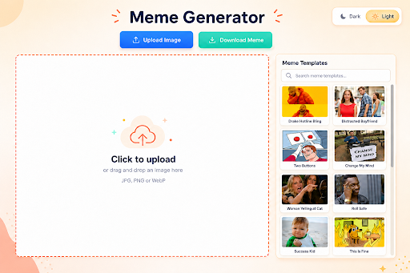
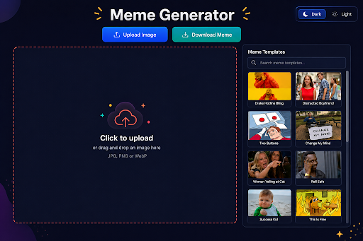
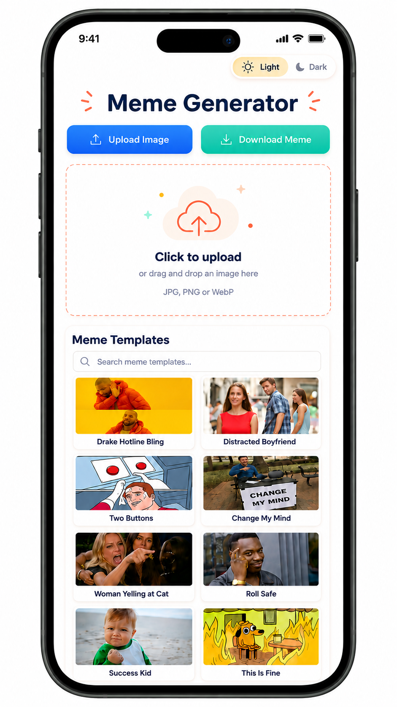
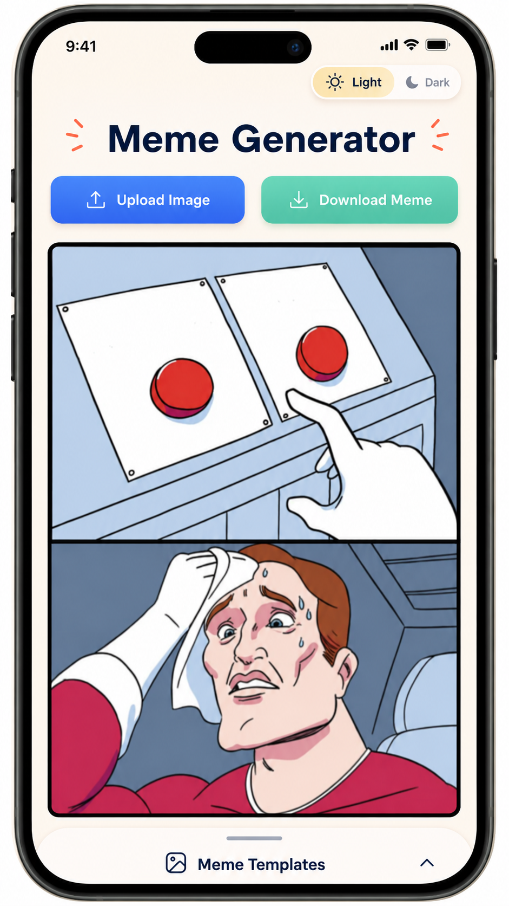

# Meme Generator Design Ideas

## Goal

The redesign should make the Meme Generator feel more playful, creative, and fast to use. The app should still be simple: users can upload an image, choose a template, add/edit text, and download the final meme without being redirected to another page.

Main design goals:

1. **Humor:** the app should feel light and fun.
2. **Creativity:** users should feel encouraged to try templates and edit text.
3. **Speed:** the main actions should be obvious and quick.
4. **No redirects:** selecting a template should update the current screen instead of opening a new page.

---

## Color Palette

### Light Mode Colors

| Color | Hex | Use |
|---|---:|---|
| Soft cream | `#FFF7E8` | Main background |
| Warm peach | `#FFE8C2` | Background gradient/accent |
| Deep navy | `#14213D` | Main text |
| Electric blue | `#2563EB` | Upload button |
| Mint green | `#2EC4B6` | Download button |
| Coral orange | `#FF6B35` | Dashed borders and playful accents |
| Meme yellow | `#FFD43B` | Highlights and active states |
| White | `#FFFFFF` | Canvas, cards, panels |
| Warm gray | `#E5DED1` | Borders/dividers |
| Slate gray | `#6B7280` | Helper text |
| Soft red | `#EF4444` | Delete/remove actions |

### Dark Mode Colors

| Color | Hex | Use |
|---|---:|---|
| Midnight navy | `#0F172A` | Main background |
| Deep black-blue | `#020617` | Dark gradient |
| Dark slate | `#1F2937` | Panels/cards |
| Blue slate | `#263449` | Elevated surfaces |
| Near white | `#F8FAFC` | Main text |
| Cool gray | `#CBD5E1` | Helper text |
| Slate border | `#334155` | Borders/dividers |
| Bright blue | `#3B82F6` | Upload button |
| Teal green | `#14B8A6` | Download button |
| Coral pink | `#FB7185` | Dashed borders/accent |
| Warm yellow | `#FACC15` | Highlights |
| Red | `#EF4444` | Delete/remove actions |

---

## Why These Colors Were Chosen

**Cream and peach** make the app feel warmer and more playful than a plain white or corporate blue background.

**Deep navy** keeps text readable while feeling softer and more modern than pure black.

**Blue** is used for uploading because it feels trustworthy and clearly marks the first main action.

**Green/mint** is used for downloading because it communicates success and completion.

**Coral/orange** adds energy and humor. It works well for the upload/canvas border because it draws attention without feeling too aggressive.

**Yellow** feels fun and meme-like. It is best for selected states, highlights, and the active light-mode toggle.

**White and warm gray** keep the interface clean and easy to scan.

**Red** should only be used for delete or remove actions so users understand it is destructive.

---

# Website Design

## Website Before a Template Is Selected

The website should keep the current structure:

- Title at the top
- Light/dark toggle in the top right
- Upload and download buttons near the top center
- Large upload/canvas area on the left
- Meme template panel on the right

This works well because the user can immediately see both options: upload their own image or choose a template.

## Website After a Template Is Selected

The page should **not redirect**. The selected template should appear in the main canvas immediately.

After selection:

- The selected meme becomes the focus.
- The template panel can shrink or collapse.
- A small “Templates” tab or button should remain visible.
- The user can reopen the template panel without losing edits.

This makes the app feel faster and more like an editor.

---

# Mobile Design

## Mobile Before a Template Is Selected

The mobile version should stack the layout vertically:

1. Light/dark toggle
2. Title
3. Upload and download buttons
4. Upload/canvas area
5. Meme templates section
6. Search bar
7. Template grid

This makes the page easy to scroll and simple to understand on a phone.

## Mobile After a Template or Image Is Selected

Once the user chooses a template or uploads an image, the selected meme should take up most of the screen.

The meme template search should be pushed down below the selected image instead of staying above it.

After selection:

1. The selected image becomes the main focus.
2. The upload/canvas placeholder disappears.
3. The meme fills most of the screen width.
4. The template section moves below the meme.
5. The template section can become a collapsed drawer labeled **Meme Templates**.
6. The user can open the drawer to switch templates.

This keeps the editing experience focused while still allowing users to change templates.

## Mobile Template Drawer

The template drawer should have two states:

### Collapsed

Only a small bar is visible at the bottom:

**Meme Templates ︿**

This keeps the selected meme large and easy to edit.

### Expanded

When the user taps the drawer, it expands and shows:

- Meme Templates heading
- Search bar
- Template grid

After the user picks another template, the drawer should collapse again.

---

# Template Cards

Template cards should be simple and easy to scan.

Design notes:

- Rounded corners
- White cards in light mode
- Dark slate cards in dark mode
- Small shadow for depth
- Clear template name under the image
- Blue or yellow border when selected
- Slight hover effect on desktop

---

# Editing Experience

Text should be edited directly on the meme.

Behavior:

- Single click text to select it.
- Double click to edit text
- User can drag the text around.
- User can resize the text box.
- Delete button appears on the selected text, (website feature: use delete key).

---

# Final Direction

## Website

- Use side-by-side canvas and template panel.
- Light mode should be the default.
- Dark mode should use playful bright accents.
- Selecting a template should update the canvas directly.

## Mobile

- Stack everything vertically before selection.
- After selection, the meme should take up most of the screen.
- The meme template search should move below the selected image.
- Templates should become a collapsible bottom drawer.
- Users should be able to switch templates without leaving the page, no redirect.

## Color Logic

- Blue = upload/start action
- Green = download/finish action
- Coral/orange = playful attention
- Yellow = fun highlight/selected state
- Cream = friendly background
- Navy = readable text
- Red = delete/remove
