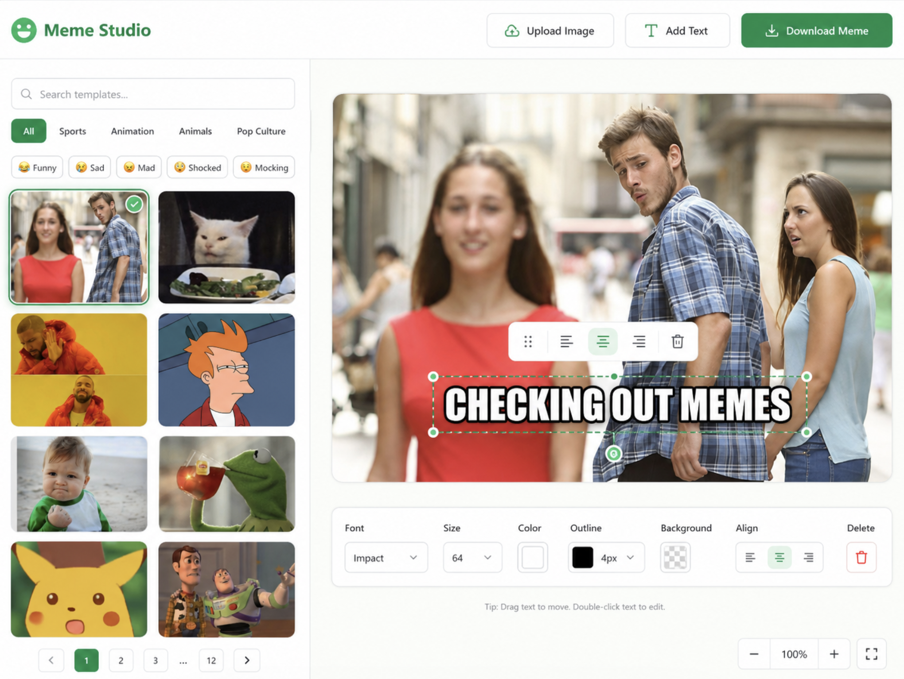

# Meme Studio — Green & White UI Design Specification



A meme generator website with a clean **green-and-white** visual direction. This document explains the UI concept shown in **design-mockup-brendan.png**, including the layout, color system, usability reasoning, and why each design choice helps the Internal Library feature feel easier to use.

## Layout Preview

### Desktop Layout

**Meme Studio desktop layout** — the screenshot shows a clean top navigation bar with the app branding on the left and the main action buttons on the right. The middle of the screen uses a two-zone structure: the **Internal Library** sidebar on the left and the **Meme Canvas + Editing Tools** on the right.

```text
 ----------------------------------------------------------------
| Meme Studio                          Upload | Add Text | Download |
 ----------------------------------------------------------------
| Internal Library         | Meme Canvas / Editor                 |
| Search templates...      |                                     |
| All Reactions Animals    |        Large Meme Canvas             |
| People Cartoon Situations|                                     |
| Funny Sad Mad Surprised  |      Floating Text Toolbar           |
| Confused                 |                                     |
|                          |                                     |
| [img] [img]              |   Font | Size | Color | Outline      |
| [img] [img]              |   Background | Align | Delete        |
| [img] [img]              |                                     |
 ----------------------------------------------------------------
```

The overall layout is built around this workflow:

```text
Choose a template → Edit the meme → Download the meme
```

## 1. Brand & Naming

The mock-up uses the name **Meme Studio** but I think we are opting for MemeBro/MemeMaxxing for something more playful and fun.

## 2. Color Palette

| Role | Suggested Color | Where It Is Used |
|---|---|---|
| App background | Off-white / very light mint | Main page background |
| Sidebar surface | White | Internal Library panel |
| Canvas surface | White / pale gray-green | Meme editor area |
| Primary green | Emerald green | Download button, active tabs, selected template, active controls |
| Soft green tint | Pale mint green | Hover states, selected alignment button, subtle highlights |
| Text | Dark green / charcoal | Headings, labels, body text |
| Border | Light gray-green | Cards, panels, input borders |
| Danger | Soft red | Delete button only |

### Why Green and White Works

The green-and-white palette makes the app feel:

- Clean
- Friendly
- Organized
- Modern
- Less overwhelming

Green is also a strong action color because it suggests progress and completion. That makes it a good choice for selected states, active filters, and the final **Download Meme** button.

In the screenshot, the green is used sparingly but clearly. It highlights the active category, the selected template, the selected alignment option, and the main download action. This keeps the UI focused instead of visually noisy.

## 3. Layout Structure & Rationale

The mock-up is organized around a simple left-to-right workflow:

```text
Choose a template → Edit the meme → Download the meme
```

This structure is important because it matches the natural order users follow when creating a meme.

### Left Sidebar = Internal Library

The Library is placed on the left because choosing an image or template usually happens before editing. This makes the sidebar feel like the starting point of the app.

The sidebar includes:

- Search bar
- Category tabs
- Emotion filter chips
- Image-first template grid
- Pagination

This gives users multiple ways to find a meme template without making the interface feel cluttered.

In **design-mockup-brendan.png**, the left sidebar works especially well because it stays narrow while still showing enough templates to browse. The two-column thumbnail grid gives users quick visual options without taking attention away from the main canvas.

### Main Area = Meme Canvas

The meme canvas is the largest visual element on the page. This is intentional because the meme itself is the main product the user is creating.

The canvas should always feel more important than:

- The template library
- The filters
- The buttons
- The editing controls

This follows visual hierarchy: the most important thing should be the biggest and easiest to focus on.

In the screenshot, the canvas takes up most of the horizontal space, which makes the design feel like a real editing tool instead of just a template picker.

### Bottom Toolbar = Text Editing Controls

The editing controls are placed directly under the canvas. This keeps them close to the meme, so users do not have to search around the screen after selecting text.

The mock-up includes controls for:

- Font
- Size
- Color
- Outline
- Background
- Alignment
- Delete

This makes the text editing workflow feel direct and easy to understand.

## 4. Button Placement

The main action buttons are moved to the top-right:

```text
Upload Image | Add Text | Download Meme
```

### Why This Is More Efficient

The top-right button placement keeps important actions visible at all times. It also separates global app actions from canvas-specific tools.

- **Upload Image** is a starting action.
- **Add Text** is a common editing action.
- **Download Meme** is the final action.

The **Download Meme** button is filled green because it is the most important final step. Upload and Add Text use lighter styling because they are supporting actions.

This button hierarchy is effective because users can immediately tell which button is the final action. The filled green download button has the strongest visual weight, so it naturally draws attention when the user is ready to finish.

## 5. Library Design

### Search Bar

The search bar lets users quickly find a meme template by keyword or reaction.

Example:

```text
Search templates...
```

This is helpful because users may already know the kind of meme they want.

In the mock-up, the search bar is at the top of the Library, which makes sense because search should come before browsing through categories.

### Category Tabs

The mock-up uses visible tabs:

```text
All | Reactions | Animals | People | Cartoon | Situations
```

Tabs are better than a dropdown here because there are only a few main categories. Users can see every option immediately, which makes browsing faster.

The active **All** tab is filled green, making it clear which category is currently selected.

### Emotion Filter Chips

The mock-up includes emotion-based filters:

```text
Funny | Sad | Mad | Surprised | Confused
```

This is one of the strongest parts of the UI idea because people often choose memes based on the feeling they want to express, not the exact character or image name.

For example, a user may think:

> “I need something surprised.”

Instead of:

> “I need a specific template name.”

This makes the Library more user-centered.

### Image-First Template Cards

The template cards are mostly image-based with very little text.

Why this works:

- Memes are recognized visually.
- Users can scan images faster than reading names.
- It reduces clutter.
- It makes the library feel cleaner.
- It keeps the focus on choosing a template quickly.

The screenshot shows this well because the thumbnails are large enough to recognize, while the text labels are either minimal or not necessary.

### Selected Template Highlight

The selected template has a green border/checkmark.

This gives immediate feedback that the user’s click worked. It also helps the user understand which template is currently active on the canvas.

This is important because without a selected state, users may not know whether they successfully chose a template.

## 6. Meme Canvas & Text Editing

The main canvas shows a selected caption with visible resize handles and a green selection outline. This makes the interface feel interactive and editable.

The caption text uses a bold meme-style font with a strong outline. This matches what users expect from meme captions and makes the text readable on top of an image.

The selected text box includes:

- Green outline
- Corner/side handles
- Rotation or movement handle
- Floating mini-toolbar

These visual cues tell the user that the text can be moved, resized, aligned, or deleted.

## 7. Floating Text Toolbar

The mock-up shows a small floating toolbar near the selected text on the meme canvas.

This is effective because the controls appear close to the thing being edited. Instead of forcing users to look around the page, the UI brings the most relevant tools directly to the selected text.

A floating toolbar can include:

- Move/drag handle
- Alignment
- Layer controls
- Delete

This makes the editor feel more interactive and modern.

The floating toolbar is especially helpful because it reduces mouse movement. A user can select text and immediately make quick edits without going down to the full toolbar every time.

## 8. Fitts’s Law / Click Target Reasoning

Fitts’s Law says that larger and closer targets are easier and faster to click.

This mock-up applies that idea in several ways.

### Large Top Buttons

The main buttons are large enough to click easily and placed in a predictable top-right area.

### Template Cards Are Big

The template thumbnails are large enough to recognize and click without needing tiny text labels.

### Editing Controls Are Near the Canvas

The toolbar is directly below the canvas, and the floating text toolbar appears near the selected text. This reduces mouse movement and makes editing faster.

### Delete Is Visually Separated

The delete button uses red and is placed at the far right of the toolbar. This helps prevent accidental clicks because it is visually separated from normal editing controls.

## 9. Accessibility & Usability

### Contrast

Dark green or charcoal text on a white background gives strong readability. Green buttons should use white text only if the green is dark enough to pass contrast standards.

### Do Not Rely on Color Alone

The selected template should not only use a green border. It should also include a checkmark icon so users can understand selection even if they have difficulty seeing color differences.

The screenshot follows this idea by using both a green border and a checkmark for the selected template.

### Clear Labels

Buttons use both icons and text labels, such as:

```text
Upload Image
Add Text
Download Meme
```

This is better than icon-only buttons because beginners do not have to guess what each button does.

### Minimum Click Size

Interactive elements should be at least 44px by 44px. This makes buttons, tabs, chips, and template cards easier to use on both desktop and mobile.

## 10. Font Direction

### UI Font

Use a clean sans-serif font such as:

- Inter
- Work Sans
- Poppins

These fonts make the interface feel modern and easy to read.

### Meme Text Font

Use a bold meme-style font such as:

- Impact
- Anton
- Bangers

The mock-up uses an Impact-style caption because users expect meme text to look bold, condensed, and highly readable.

## 11. Mobile Layout

The desktop layout works well because there is enough horizontal space:

```text
Internal Library | Meme Canvas + Tools
```

On mobile, the layout should stack:

```text
Canvas
Tools
Internal Library
```

### Why This Works

The canvas should appear first on mobile because users need to see what they are editing. The library and tools can appear below because side-by-side panels become too cramped on smaller screens.

A mobile version could use:

- Full-width canvas
- Horizontal scrolling toolbar
- Collapsible Internal Library
- 2-column or 3-column template grid

This keeps the same feature set while making the design usable on smaller screens.

## 12. Color Psychology / Context

Green supports the feeling of:

- Creation
- Progress
- Safety
- Completion

White and off-white support:

- Cleanliness
- Simplicity
- Focus
- Breathing room

Together, green and white make the meme editor feel less chaotic than a dark or neon-heavy interface. This is useful for a class project because the UI looks polished and easy to explain.

## 13. Intended User Flow

The full user flow is:

```text
Arrive → search/filter templates → select a template → edit caption → adjust style → download meme
```

The mock-up supports this flow by placing:

- The Internal Library on the left
- The canvas in the largest central/right area
- Text tools near the canvas
- Download in the top-right as the final action

This makes the app understandable without needing a tutorial.

## 14. Why This Design Is Effective

This design is effective because it balances meme browsing and meme editing without making either side feel overwhelming.

The Internal Library is always available, but it does not dominate the screen. The canvas stays large, so the user remains focused on the meme they are creating. The editing tools are close to the canvas, and the most important final action, **Download Meme**, is easy to find.

The design also supports both beginner and experienced users. Beginners can follow the visible workflow, while faster users can quickly search, click a template, edit the caption, and download.
