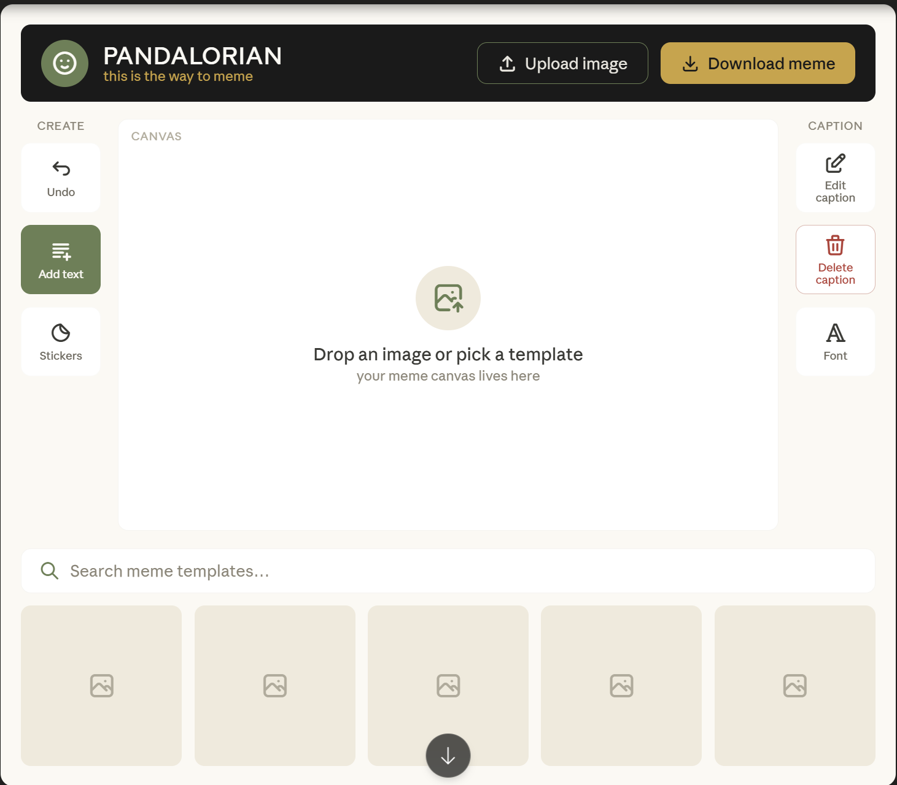
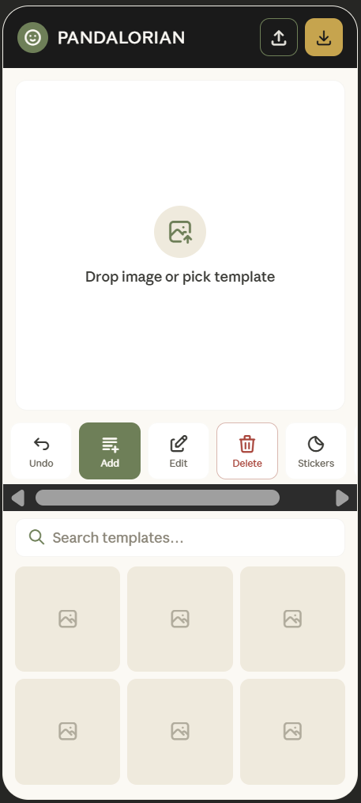

# Pandalorian — UI Design Specification

A meme generator website with a panda + Mandalorian/Yoda-inspired theme. This document specifies the polished UI concept, the color system, and the design rationale behind every major decision.

---

## Layout Previews

### Desktop layout

### Mobile layout

---

## 1. Brand & Naming Cleanup

The original wireframe said "Meme Bro" — everything has been renamed to **Pandalorian**.

One small but important label change: throughout the right toolbar, "Original Text" was replaced with **"Caption."** Memes don't really have "original text" as a concept users think about; they have captions (top text / bottom text). "Caption" is shorter, instantly understood, and fits a narrow toolbar button without wrapping awkwardly. This follows the plain-language / "match between system and the real world" usability heuristic.

**Tagline:** *"This is the way to meme."* It's a recognizable Mandalorian riff that signals the theme without needing licensed assets, and it keeps the tone playful-but-clever rather than childish.

---

## 2. Color Palette

| Role | Name | Hex | Where it's used |
|------|------|-----|-----------------|
| Primary dark | Panda Black | `#1A1A1A` | Top bar background, primary text, icon strokes |
| Base background | Off-white / Panda Cream | `#FBF9F4` | App background (warmer than pure white, easier on eyes) |
| Surface | Pure White | `#FFFFFF` | Canvas, cards, toolbar buttons |
| Primary action | Yoda Green | `#6E7F58` | "Add text", primary tool, focus rings, active states |
| Light green tint | Soft Sage | `#EFEADD` (neutral) / `#DDE3D2` (green tint) | Hover fills, empty template thumbnails |
| Accent | Mandalorian Gold | `#C6A44E` | Download button, tagline, premium accents |
| Warm brown (robe) | Robe Brown | `#7A5A40` | Secondary brand accents, sticker tool, dividers |
| Warm brown light | Sand | `#C9B79C` | Subtle backgrounds, borders on brown elements |
| Danger | Clay Red | `#A8443A` | Delete caption (muted, on-theme — not a harsh fire-engine red) |
| Muted text | Stone | `#6B675D` | Secondary labels, placeholder text |

**Why these specific values.** Everything is deliberately desaturated. A true Star Wars gold (`#FFD700`) and a bright Yoda green (`#4CAF50`) would read as toy-like and clash. Muting them toward sage and antique gold is what keeps the brand "playful but not childish." The danger red is a warm clay tone rather than pure red so it sits inside the earthy palette instead of screaming — but it's still distinct enough to read as "destructive."

---

## 3. Layout Structure & Rationale

The three-zone skeleton from the original wireframe is preserved — top bar, three-column middle (tool / canvas / tool), bottom template drawer — because it's genuinely good. Here's what changed and why.

**Top bar.** Brand sits far left, the two file actions sit far right. Upload and Download are the bookends of the entire workflow (you start by getting an image in, you end by getting an image out), so anchoring them in opposite corners of the top bar maps the visual layout to the actual user flow. Download is gold and filled; Upload is an outlined "ghost" button. This is visual hierarchy through contrast — Download is the success moment, the payoff, so it gets the most saturated color and a solid fill, while Upload is a supporting action. In the original wireframe both buttons looked identical in weight, which hid which one mattered.

**Why a dark top bar.** Pulling the black to the top creates a strong horizontal anchor and lets the panda logo (white-and-black) pop against it. It also frames the bright canvas below — the eye is drawn into the white workspace, which is exactly where you want attention during editing.

**Left toolbar = "Create" tools, right toolbar = "Caption" tools.** Each column gets a tiny section header. This is the grouping/proximity principle (Gestalt): tools that do similar jobs are clustered and visually separated from the other group. The original wireframe had Undo + Add Text on the left and the caption tools on the right, which was already a sensible split — this just makes the logic explicit so users learn it faster. The empty slots become Stickers (left) and Font (right), which round out each group thematically.

**Canvas stays dominant.** It's the single largest element, centered, on the brightest surface. Visual hierarchy 101 — the most important thing (the thing the user is actually making) is the biggest and most central. A faint "CANVAS" label and a friendly empty state ("Drop an image or pick a template") mean a brand-new user is never staring at a blank box wondering what to do.

**Bottom template drawer.** The search bar spans the full width with the search icon in green, and template thumbnails sit in a row beneath it. Placing this at the bottom respects the natural reading flow: title → tools → canvas → "where do I get something to start with." For many users, picking a template is actually step one, so an alternative worth testing is floating this higher — but bottom placement keeps the canvas as the hero and matches the original instinct.

---

## 4. Fitts's Law / Click Targets

Fitts's Law says a target is faster to hit when it's bigger and closer. Three applications here:

- The toolbar buttons are square-ish (~56px tall on desktop) rather than the thin slots in the original wireframe — bigger targets, fewer misclicks, and they fit an icon plus a text label. Icon-only buttons force users to guess or hover-and-wait; the label removes ambiguity at almost no space cost.
- The two top-bar actions are placed in screen corners. Corners and edges are "infinitely deep" targets in Fitts's terms — you can slam the cursor into them without overshooting — so the most-used file actions get the most forgiving real estate.
- Destructive **Delete caption** is intentionally not placed adjacent to a frequently-used button, reducing accidental clicks. It's also the only button with a red outline, so it's visually quarantined.

---

## 5. Accessibility & Contrast

Run these against WCAG when you build:

- Panda Black `#1A1A1A` on Off-white `#FBF9F4` gives roughly a 16:1 contrast ratio — far above the 4.5:1 minimum for body text.
- Gold `#C6A44E` is used as a background for the Download button with black text on top (passes comfortably). **Never use gold as text on white**, because gold-on-white fails contrast.
- White text on Yoda Green `#6E7F58` lands around 4.6:1, which passes for the button labels at the sizes used. Bump the green slightly darker (`#5E6E4A`) if you want a safer margin for smaller text.
- **Touch targets:** every interactive element should be at least 44×44px (Apple's guideline) / 48×48px (Google's). The desktop toolbar buttons already clear this; on mobile, make sure the tool strip icons get a full 48px tap zone even if the visible icon is smaller.
- **Don't rely on color alone.** Delete is red *and* has a trash icon *and* says "Delete." Add-text is green *and* filled *and* labeled. This covers color-blind users.
- Add visible focus rings (use Yoda Green, 2px) for keyboard navigation, and give every icon button an `aria-label`.

---

## 6. Font Pairing (Google Fonts)

- **Display / brand / headings: Fredoka** — rounded, friendly, slightly chunky. It carries the "cute panda" personality without tipping into Comic Sans territory. Use it for the PANDALORIAN wordmark and any big playful headings.
- **UI / body / labels: Inter** (or **Work Sans** if you want a touch more warmth). A clean, highly legible workhorse for button labels, the search field, and template names. Pairing a personality display face with a neutral UI face is a reliable combo — the display font does the brand work, the body font does the legibility work, and they don't compete.
- **Meme text on the canvas itself: Anton or classic Impact** as the default caption font, since that bold condensed look *is* the meme vernacular. This is "match the real world" — users expect meme text to look like meme text.

---

## 7. Mobile Layout

Two side toolbars can't survive on a ~375px-wide phone screen, so the structure folds like this, top to bottom:

A compact top bar keeps the logo and icon-only Upload/Download buttons. The canvas becomes the full-width hero directly below. The two toolbars collapse into one horizontal scrolling tool strip pinned just below the canvas — Undo, Add, Edit, Delete, Stickers, Font — each a 48px tap target. Below that sits the search bar, then template thumbnails in a 3-across grid that scrolls.

> **Implementation note:** the desktop and mobile layouts are the *same* HTML, rearranged with a CSS media query — no separate page and no JavaScript needed for the layout switch. Write the mobile (stacked, single-column) rules as the default, then override into the three-column grid inside `@media (min-width: 768px)`. The `<meta name="viewport" content="width=device-width, initial-scale=1.0">` tag is required for the breakpoints to fire on real phones.

---

## 8. Color Psychology / Context

A quick note on *why* each color does its job:

- **Green** carries "go / create / safe," which is why it's on the primary Add-text action and focus states.
- **Gold** reads as "reward / premium / completion," which is why it's reserved almost exclusively for Download — the one moment of payoff.
- The **warm cream base** (rather than clinical white) makes the whole tool feel approachable and friendly, supporting the "playful" brief.
- The **black top bar** supplies the structure and seriousness that keeps it from feeling like a kids' toy.
- The **clay-red delete** borrows red's universal "caution" association but stays inside the earthy palette so it doesn't visually shout over everything else.

---

## 9. Intended User Flow

The whole layout is organized around this path:

**Arrive → get an image in** (Upload top-right, or pick a template bottom) **→ it lands on the canvas → add and edit captions** using the side tools **→ Download** (top-right gold).

Upload and Download being diagonal bookends, the canvas being the central hero, and the tools flanking it are all in service of making that flow feel obvious without a tutorial.