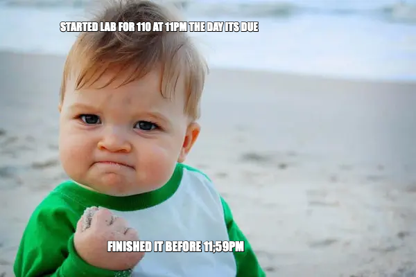
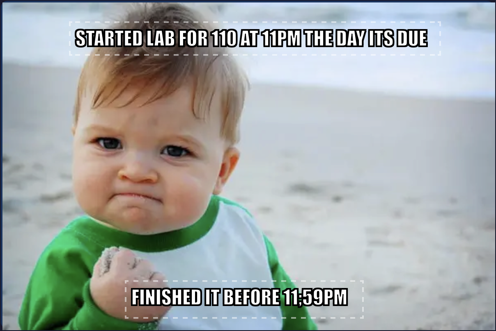

# AI Use Log

This document tracks each version of the project, including prompts used, AI model used, observations, feedback, and next steps.

## Table of Contents

[Version 1](#version-1) (5/11/26)  
[Version 2](#version-2)  

---

## Version 1

### Prompt Used

Create a website where a user can upload photo, click on the uploaded photo to add text, and the user can download the the edited image.  

* text that the user adds must be shiftable based on drag-and-drop and the text should be automatically resizable based of drag-and-drop of the corners of the text box
* the default text should be the Impact font with white text and black borders
* font can be modified with a toggle bar above the text box that has a dropdown menu of the following other fonts: Arial, Comic Sans, Helvetica, Montserrat
* allow users to choose between no border and border (the default option should be borders)

### AI Model Used 

Tim - I used Claude Opus 4.6 in high effort plan mode.

## Observations 

#### Goals Achieved

* Text added by the user is draggable and repositionable via drag-and-drop
* Text box corners support drag-and-drop resizing to automatically resize the text box
* Default font is Impact with white text and black borders
* A toggle bar above the text box includes a dropdown menu allowing font selection from: Arial, Comic Sans, Helvetica, and Montserrat
* Users can toggle between no border and border styles, with border enabled as the default
* Download works on Mac

#### Goals Not Achieved (Evaluate and re-implement)

* Font size does not automatically resize based on the text box size — font resizability was not achieved.
* Downloaded meme has a different text appearance than what is seen on the website (example below with downloaded meme on the left and the webpage version on the right)

#### Next steps for v2

* Fix font automatic resizing relative to text-box size 
* Support drag-and-drop image files uploads
* Have the text-box be typable as soon as it is generated (right now, user clicks on image, text-box pops up, and user has to click inside the text-box to enable typing. This reduces performance, so text-box should be in type mode as soon as it is generated)
* Make default text all caps
* Make text box resize when inputted text is not all visible
* Fix the size of the image to be within a certain range as right now, some images can appear really big or really small 
* Generate a mini template library, where the user can filter/search based on key words
* Improve design/ui (save for future versions, but something to think about as we implement)

---

## Version 2

Version 2 was focused on fixing some of the issues from Version 1. The main things worked on were making the text box easier to type in right away, making the text box easier to move, and trying to make the font resize better with the text box.

### AI Model Used 

Tim - I used Claude Opus 4.6 in medium thinking mode.

## Version 2 — Iteration 1

### Prompt Used

We are working on V1 of a meme generator web app.

Current behavior:
* Users click the image/canvas to add a new text box.
* After adding the text box, the user has to manually click inside the text area before typing.
* This slows down the workflow.

Goal:
When a new text box is created, the text area should immediately become active so the user can start typing right away.

Requirements:
1. After clicking to create a new text box, focus the textarea automatically.
2. Put the cursor inside the text area immediately.
3. If default placeholder text exists, make it easy to replace.
4. This should work on desktop.
5. It should also work as well as possible on mobile/touch devices.
6. Do not break dragging, resizing, deleting, font selection, border toggle, or exporting.
7. Keep the current structure and make a minimal clean change.

Please inspect:
* TextBox.js
* TextBoxManager.js
* any related event handling files

Then update the code so every newly created text box is ready for immediate typing.
Explain what files you changed and why.

## Observations 

#### Goals Achieved

* Text box now tries to let the user type as soon as it appears
* Focus was moved so it happens after the text box is fully created
* A `focusTextarea()` method was added to help the text area become active
* Mobile tapping was improved by adding a `touchend` listener
* Existing features like drag, resize, delete, font select, border toggle, and export were not changed

#### Goals Not Achieved (Evaluate and re-implement)

* Mobile behavior still needs to be tested because some browsers handle focus differently
* There could be an issue where one mobile tap creates two text boxes if both touch and mouse events fire
* Need to check if the phone keyboard opens right away when a text box is created

#### Next steps for next iteration

* Test that one click or tap only creates one text box
* Make sure the user can type right away after adding a new text box
* Add an easier way to move text boxes, especially for mobile users

---

## Version 2 — Iteration 2

### Prompt Used

We are working on V1 of a meme generator web app.

Current issue:
* Text boxes can currently be moved, but it is hard to move them accurately.
* On mobile, moving text boxes with fingers/thumbs is especially difficult.
* Users may accidentally edit text when they are trying to move it, or struggle to grab the right area.

Goal:
Add a clear, easy way to move text boxes.

Preferred design:
Add a visible “Move” handle/button to each text box toolbar, such as:
* a button labeled “Move”
* or an icon-like button with text such as “↕ Move” or “✥”

Behavior:
1. Users should be able to drag the text box by pressing/clicking/touching the Move handle.
2. The move handle should work well with mouse and touch input.
3. Use pointer events if possible so desktop and mobile can share the same logic.
4. The text area should remain editable when the user taps/clicks inside it.
5. Dragging should not accidentally trigger text editing.
6. Moving should keep the text box inside the image/container bounds.
7. Existing resize handles should still work.
8. Existing delete, font select, border toggle, and export behavior should still work.
9. Keep the current architecture and avoid rewriting the entire app.

Please inspect:
* TextBox.js
* DragResize.js
* TextBoxManager.js
* styles.css

Then implement a clean move handle/button for each text box that makes moving text boxes easier on desktop and mobile.
Explain what files you changed and why.

## Observations 

#### Goals Achieved

* A `✥ Move` button was added to the toolbar so the user has a clear place to drag from
* The old drag behavior was removed because dragging from the whole text box made it harder to type and move correctly
* Moving now uses pointer events, so it should work better for both mouse and touch
* The text area is no longer the main drag area, so users should be less likely to accidentally move the text box while trying to type
* Mobile moving should be easier because the move button has `touch-action: none`
* Resize handles were left the same so the old resizing behavior was not broken

#### Goals Not Achieved (Evaluate and re-implement)

* Resize handles are still mostly desktop-based and may not work as well on mobile
* The toolbar may need more visual polish later because more buttons are being added
* Need to test if mobile scrolling still gets in the way when moving a text box

#### Next steps for next iteration

* Test that the move button works on desktop and mobile
* Make sure tapping inside the text box still lets the user edit text
* Work on fixing the font size issue so the text changes size when the box is resized

---

## Version 2 — Iteration 3

### Prompt Used

We are working on V1 of a meme generator web app.

Current behavior:
* Users upload an image.
* Users click the image to create editable text boxes.
* Text boxes can be resized.
* When the meme is downloaded, the text scales correctly based on the resized box.
* However, while editing on the website, resizing the text box only changes the box size, not the visible text size.

Goal:
Fix the live editor so that when a user resizes a text box, the text inside visually resizes immediately on the website, matching what will appear in the downloaded PNG.

Important requirements:
1. The live text size should update while resizing, not only after export.
2. The export/download result should still match the live editor as closely as possible.
3. Do not rewrite the whole app.
4. Keep the current file structure and architecture as much as possible.
5. Make the smallest clean change needed.
6. Avoid breaking dragging, deleting, font selection, border toggle, or exporting.

Please inspect the relevant files, especially:
* TextBox.js
* DragResize.js
* TextBoxManager.js
* Exporter.js
* styles.css

Then update the code so text resizing is reflected both live in the editor and in the exported meme.
Explain what files you changed and why.

## Observations 

#### Goals Achieved

* A `syncFontSize()` method was added to `TextBox.js`
* The method tried to set the font size based on the height of the text box
* `DragResize.js` was updated so `syncFontSize()` runs during resizing
* The goal was to make the live website text size match the downloaded meme text size
* This was a small change and did not rewrite the whole app

#### Goals Not Achieved (Evaluate and re-implement)

* Font size still did not visually resize enough on the website
* The text still looked like it was staying the same size while resizing the box
* The fix relied too much on a hidden formula instead of letting the text size be directly controlled
* The downloaded version and website version may still not match correctly

#### Next steps for next iteration

* Make font size an actual value stored in each text box
* Add visible text-size controls like `A−`, a font-size number, and `A+`
* Make sure the export uses the same text size that the user sees on the website
* Make resizing and text-size controls work together

---

## Version 2 — Iteration 4

### Prompt Used

We are working on V1 of a meme generator web app.

Current state:
* Text boxes can be created on top of the image.
* Text boxes have a toolbar.
* There is now a ✥ Move button used to move the text box.
* Text boxes can be resized.
* There is a TextBox.prototype.syncFontSize() method using:
  `Math.max(12, Math.floor(height * 0.4))`
* DragResize.js calls textBox.syncFontSize() during resize.
* However, the visible text in the website editor still looks like the same size when resizing the text box. The previous fix did not solve the issue clearly enough.

New goal:
We need text sizing to be visible and controllable in the editor.

What we want:
1. When the user resizes/drags the resize handles of the text box, the text inside should visibly scale with the text box.
2. Add a clear text-size control in the toolbar, near the ✥ Move button.
3. The text-size control should let the user make the text bigger or smaller manually.
4. When the text size changes manually, the text box should resize/fit around the text better instead of staying awkwardly the same.
5. The live editor should show the current font size clearly.
6. Export/download should use the same font size that is visible in the editor.

Preferred toolbar layout:
* ✥ Move
* Text size controls, such as:
  * A−
  * font size display like “24px”
  * A+
* Existing controls after that:
  * font dropdown
  * border toggle
  * delete

Implementation requirements:
1. Store font size as actual state on each TextBox object, for example this.fontSize.
2. Do not rely only on CSS font-size or only on offsetHeight.
3. When a text box is resized, update this.fontSize and textarea.style.fontSize so the change is obvious live.
4. When A+ or A− is clicked/tapped, update this.fontSize, update textarea.style.fontSize, update the visible font-size display, and resize the text box if needed.
5. Exporter.js must read the TextBox font size state or computed textarea font size instead of recalculating a different size secretly.
6. The live website version and downloaded PNG should match as closely as possible.
7. Keep the existing ✥ Move button behavior.
8. Keep mobile usability in mind. The A− and A+ buttons should be easy to tap.
9. Do not rewrite the entire app.
10. Keep changes clean and limited to the relevant files.

Important:
The previous formula-based fix did not visually work. Please inspect why the textarea may not be visually changing size. Possible causes could include CSS overrides, textarea sizing, line-height, transform issues, cached styles, or Exporter.js using a different sizing source.

Files to inspect:
* TextBox.js
* DragResize.js
* Exporter.js
* styles.css
* TextBoxManager.js if needed

After updating the code, explain:
1. Why the previous syncFontSize approach was not enough.
2. What new font-size state/control was added.
3. How resizing the text box changes the live text size.
4. How A− and A+ change the font size.
5. How the text box resizes/fits when font size changes.
6. How Exporter.js now matches the live editor.
7. What files changed.

## Observations 

#### Goals Achieved

* The prompt changed the approach from automatic hidden resizing to visible text-size controls
* The prompt asked for font size to be stored inside each text box instead of only being calculated during export
* The prompt asked for `A−`, font-size display, and `A+` controls in the toolbar
* The prompt asked for the downloaded meme to use the same font size that appears on the website
* This should make the user have more control over how the meme text looks

#### Goals Not Achieved (Evaluate and re-implement)

* This still needs to be tested after implementation
* Need to check if the text visibly changes size on the website
* Need to check if the text box resizes or fits better when the font size changes
* Need to check if the downloaded meme matches the website version
* Need to check if the new toolbar buttons are easy to use on mobile

#### Next steps for v3

* Test the text-size controls on desktop and mobile
* Compare the downloaded meme with the webpage version again
* Fix any mismatch between live text and exported text
* Improve mobile resizing since the resize handles are still not fully optimized for touch
* Continue working toward drag-and-drop image upload and a small meme template library
